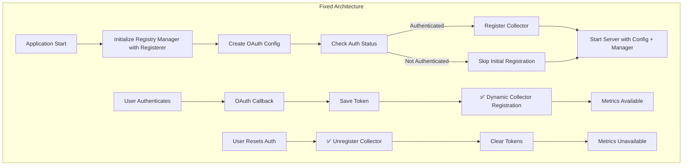

# Zaim Prometheus Exporter - 修正設計仕様書（改訂版）

## エグゼクティブサマリー

本文書は、Zaim Prometheus Exporterの4つの設計上の問題を修正するための包括的な設計仕様です。

### 修正対象の問題

1. **🔴 HIGH**: Collector登録問題 - リセット時にUnregisterCollectorが呼ばれない
2. **🔴 HIGH**: テストレジストリ汚染 - ユニットテストがグローバルPrometheusレジストリを汚染
3. **🟡 MEDIUM**: OAuth設定欠落 - サーバーがoauth1.Configを受け取らない
4. **🟡 MEDIUM**: パス処理 - 既存コードは正しく動作（修正不要）

---

## 1. システムアーキテクチャ設計

### 1.1 修正後のアーキテクチャ



### 1.2 主要な設計変更点

#### 変更1: Registry Managerにprometheus.Registererを注入
- **理由**: テスト時に独立したレジストリを使用可能にする
- **影響**: グローバルレジストリ汚染を防止、テストの並列実行が可能

#### 変更2: ServerにOAuth Configを渡す
- **理由**: 認証コールバック時にZaimクライアントを作成するため
- **影響**: 動的なCollector登録が可能になる

#### 変更3: リセットフローにUnregisterCollectorを追加
- **理由**: 古いトークンでメトリクスが提供され続けるのを防ぐ
- **影響**: 認証リセット後、メトリクスが適切に無効化される

---

## 2. コンポーネント設計

### 2.1 TransactionFetcher インターフェース（新規）

```go
// internal/zaim/client.go
package zaim

import "context"

// TransactionFetcher は取引データ取得の抽象化インターフェース
// テスタビリティのため、具体的な実装（Client）から分離
type TransactionFetcher interface {
    GetCurrentMonthTransactions(ctx context.Context) ([]Transaction, error)
}

// Client が TransactionFetcher を実装していることをコンパイル時に保証
var _ TransactionFetcher = (*Client)(nil)

// Client 構造体はそのまま（変更不要）
type Client struct {
    httpClient *http.Client
    logger     *zap.Logger
}

// 既存のメソッドはそのまま（TransactionFetcher を実装）
func (c *Client) GetCurrentMonthTransactions(ctx context.Context) ([]Transaction, error) {
    // ... 既存実装
}
```

**設計のポイント**:
- **依存性逆転の原則**: CollectorはHTTPクライアントではなく、インターフェースに依存
- **テスタビリティ**: HTTPクライアント不要のモック実装が可能
- **後方互換性**: 既存の `*zaim.Client` はそのまま使用可能（インターフェースを実装）

---

### 2.2 Registry Manager（改訂版）

```go
// internal/metrics/registry_manager.go
package metrics

import (
    "sync"
    "github.com/prometheus/client_golang/prometheus"
    "github.com/yourusername/zaim-prometheus-exporter/internal/zaim"
    "go.uber.org/zap"
)

// Manager manages the lifecycle of Prometheus collectors
type Manager struct {
    mu               sync.RWMutex
    currentCollector prometheus.Collector
    registerer       prometheus.Registerer // 注入されたRegisterer
    logger           *zap.Logger
    aggregator       *Aggregator
}

// NewManager creates a new registry manager
// registerer: prometheus.Registerer interface for testability
func NewManager(registerer prometheus.Registerer, logger *zap.Logger) *Manager {
    return &Manager{
        registerer: registerer,
        logger:     logger,
        aggregator: NewAggregator(),
    }
}

// RegisterCollector registers a new Zaim collector
// Automatically unregisters existing collector if present
func (m *Manager) RegisterCollector(client zaim.TransactionFetcher) error {  // ✅ インターフェース型
    m.mu.Lock()
    defer m.mu.Unlock()

    // Unregister existing collector if present
    if m.currentCollector != nil {
        m.registerer.Unregister(m.currentCollector)
        m.logger.Info("unregistered existing collector")
    }

    // Create and register new collector
    collector := NewZaimCollector(client, m.aggregator, m.logger)
    if err := m.registerer.Register(collector); err != nil {
        return err
    }

    m.currentCollector = collector
    m.logger.Info("registered new Zaim collector")
    return nil
}

// UnregisterCollector removes the current collector from the registry
func (m *Manager) UnregisterCollector() {
    m.mu.Lock()
    defer m.mu.Unlock()

    if m.currentCollector != nil {
        m.registerer.Unregister(m.currentCollector)
        m.currentCollector = nil
        m.logger.Info("unregistered collector")
    }
}

// IsRegistered returns whether a collector is currently registered
func (m *Manager) IsRegistered() bool {
    m.mu.RLock()
    defer m.mu.RUnlock()
    return m.currentCollector != nil
}
```

**設計のポイント**:
- `prometheus.Registerer`インターフェースを注入することでテスタビリティを確保
- `zaim.TransactionFetcher`インターフェース受け入れによりモックが安全
- 本番環境では`prometheus.DefaultRegisterer`を使用
- テストでは`prometheus.NewRegistry()`と`mockTransactionFetcher`を使用して隔離

### 2.3 Server修正設計（改訂版）

```go
// internal/server/server.go の修正
package server

import (
    "github.com/dghubble/oauth1"
    "github.com/yourusername/zaim-prometheus-exporter/internal/metrics"
    // ... other imports
)

type Server struct {
    authManager       *auth.Manager
    requestTokenStore storage.RequestTokenStore
    registryManager   *metrics.Manager    // 追加
    oauthConfig       *oauth1.Config      // 追加
    logger            *zap.Logger
    router            *mux.Router
}

// NewServer creates a new HTTP server
func NewServer(
    authManager *auth.Manager,
    requestTokenStore storage.RequestTokenStore,
    registryManager *metrics.Manager,   // 追加
    oauthConfig *oauth1.Config,         // 追加
    logger *zap.Logger,
) *Server {
    s := &Server{
        authManager:       authManager,
        requestTokenStore: requestTokenStore,
        registryManager:   registryManager,   // 追加
        oauthConfig:       oauthConfig,       // 追加
        logger:            logger,
    }

    s.setupRoutes()
    return s
}

// handleAuthCallback handles OAuth callback and dynamically registers collector
func (s *Server) handleAuthCallback(w http.ResponseWriter, r *http.Request) {
    oauthToken := r.URL.Query().Get("oauth_token")
    oauthVerifier := r.URL.Query().Get("oauth_verifier")

    if oauthToken == "" || oauthVerifier == "" {
        s.logger.Error("missing OAuth parameters",
            zap.String("token", oauthToken),
            zap.String("verifier", oauthVerifier))
        http.Error(w, "Missing OAuth parameters", http.StatusBadRequest)
        return
    }

    ctx := r.Context()

    // Retrieve request secret
    requestSecret, err := s.requestTokenStore.Get(ctx, oauthToken)
    if err != nil {
        s.logger.Error("failed to get request secret", zap.Error(err))
        http.Error(w, "Failed to retrieve request token", http.StatusInternalServerError)
        return
    }

    // Exchange for access token
    if err := s.authManager.HandleCallback(ctx, oauthToken, requestSecret, oauthVerifier); err != nil {
        s.logger.Error("failed to handle OAuth callback", zap.Error(err))
        http.Error(w, "Failed to complete OAuth flow", http.StatusInternalServerError)
        return
    }

    // 🔧 FIX: Dynamic collector registration after authentication
    if token, err := s.authManager.GetClient(ctx); err == nil {
        zaimClient := zaim.NewClient(s.oauthConfig, token, s.logger)
        if err := s.registryManager.RegisterCollector(zaimClient); err != nil {
            s.logger.Error("failed to register collector", zap.Error(err))
            // Continue even if registration fails - user can retry
        } else {
            s.logger.Info("successfully registered collector after authentication")
        }
    } else {
        s.logger.Warn("failed to get client after authentication", zap.Error(err))
    }

    // Clean up request token
    _ = s.requestTokenStore.Delete(ctx, oauthToken)

    // Success page
    tmpl := template.Must(template.New("success").Parse(successHTML))
    tmpl.Execute(w, nil)
}

// handleAuthReset handles authentication reset and unregisters collector
func (s *Server) handleAuthReset(w http.ResponseWriter, r *http.Request) {
    // 🔧 FIX: Unregister collector before clearing tokens
    s.registryManager.UnregisterCollector()
    s.logger.Info("unregistered collector before auth reset")

    if err := s.authManager.ResetAuth(); err != nil {
        s.logger.Error("failed to reset auth", zap.Error(err))
        http.Error(w, "Failed to reset authentication", http.StatusInternalServerError)
        return
    }

    w.Header().Set("Content-Type", "application/json")
    json.NewEncoder(w).Encode(map[string]string{
        "status":  "success",
        "message": "Authentication reset successfully",
    })
}
```

**設計のポイント**:
- `handleAuthCallback`: 認証成功後に動的にCollectorを登録
- `handleAuthReset`: トークンクリア前にCollectorを解除
- OAuth Configをサーバー内で保持し、動的なクライアント作成に使用

### 2.4 Main関数の修正設計

```go
// cmd/exporter/main.go の修正
func main() {
    _ = godotenv.Load()

    // Parse command flags
    var (
        healthCheck = flag.Bool("health", false, "Run health check and exit")
        debugMode   = flag.Bool("debug", false, "Enable debug logging")
    )
    flag.Parse()

    // Initialize logger
    logger := initLogger(*debugMode)
    defer logger.Sync()

    // Health check mode
    if *healthCheck {
        runHealthCheck(logger)
        return
    }

    // Load configuration
    config := loadConfig()

    // Validate configuration
    if config.ConsumerKey == "" || config.ConsumerSecret == "" {
        logger.Fatal("ZAIM_CONSUMER_KEY and ZAIM_CONSUMER_SECRET must be set")
    }

    // 🔧 FIX: Create OAuth config early for sharing with server
    oauthConfig := &oauth1.Config{
        ConsumerKey:    config.ConsumerKey,
        ConsumerSecret: config.ConsumerSecret,
        Endpoint: oauth1.Endpoint{
            RequestTokenURL: "https://api.zaim.net/v2/auth/request",
            AuthorizeURL:    "https://auth.zaim.net/users/auth",
            AccessTokenURL:  "https://api.zaim.net/v2/auth/access",
        },
    }

    // Initialize token storage
    tokenStorage, err := auth.NewFileTokenStorage(config.TokenFile, config.EncryptionKey)
    if err != nil {
        logger.Fatal("failed to initialize token storage", zap.Error(err))
    }

    // Initialize OAuth manager
    oauthMgr := auth.NewManager(config.ConsumerKey, config.ConsumerSecret, tokenStorage, logger)

    // 🔧 FIX: Create registry manager with injected registerer
    registryManager := metrics.NewManager(prometheus.DefaultRegisterer, logger)

    // Initialize Zaim client if authenticated
    if oauthMgr.IsAuthenticated() {
        token, err := oauthMgr.GetClient(context.Background())
        if err == nil {
            zaimClient := zaim.NewClient(oauthConfig, token, logger)
            if err := registryManager.RegisterCollector(zaimClient); err != nil {
                logger.Warn("failed to register collector on startup", zap.Error(err))
            } else {
                logger.Info("registered Zaim metrics collector on startup")
            }
        } else {
            logger.Warn("failed to get client on startup", zap.Error(err))
        }
    } else {
        logger.Warn("not authenticated with Zaim API, metrics will not be available")
    }

    // Initialize request token store
    var requestTokenStore storage.RequestTokenStore
    if redisURL := config.RedisURL; redisURL != "" {
        store, err := storage.NewRedisRequestTokenStore(redisURL, 10*time.Minute, logger)
        if err != nil {
            logger.Fatal("failed to initialize redis store", zap.Error(err))
        }
        defer store.Close()
        requestTokenStore = store
        logger.Info("using redis for request token storage")
    } else {
        requestTokenStore = storage.NewMemoryRequestTokenStore(logger)
        logger.Warn("using in-memory request token storage (not suitable for multiple instances)")
    }

    // 🔧 FIX: Pass registry manager and OAuth config to server
    srv := server.NewServer(oauthMgr, requestTokenStore, registryManager, oauthConfig, logger)

    httpServer := &http.Server{
        Addr:         fmt.Sprintf(":%d", config.Port),
        Handler:      srv.Router(),
        ReadTimeout:  15 * time.Second,
        WriteTimeout: 15 * time.Second,
        IdleTimeout:  60 * time.Second,
    }

    // Start server in goroutine
    go func() {
        logger.Info("starting server", zap.Int("port", config.Port))
        if err := httpServer.ListenAndServe(); err != nil && err != http.ErrServerClosed {
            logger.Fatal("server failed", zap.Error(err))
        }
    }()

    // Wait for interrupt signal
    quit := make(chan os.Signal, 1)
    signal.Notify(quit, syscall.SIGINT, syscall.SIGTERM)
    <-quit

    logger.Info("shutting down server...")

    // Graceful shutdown with timeout
    ctx, cancel := context.WithTimeout(context.Background(), 10*time.Second)
    defer cancel()

    if err := httpServer.Shutdown(ctx); err != nil {
        logger.Fatal("server forced to shutdown", zap.Error(err))
    }

    logger.Info("server exited")
}
```

**設計のポイント**:
- OAuth Configを早期に作成し、管理とサーバーで共有
- Registry Managerに`prometheus.DefaultRegisterer`を注入
- サーバーにRegistry ManagerとOAuth Configを渡す

---

## 3. ローカル開発環境の改善設計

### 3.1 設定の階層化（既存設計から変更なし）

```go
// cmd/exporter/main.go の loadConfig()
func loadConfig() *Config {
    // デフォルトパスの決定ロジック
    defaultTokenFile := "./data/oauth_tokens.json"
    if inDocker() {
        defaultTokenFile = "/data/oauth_tokens.json"
    }

    cfg := &Config{
        ConsumerKey:    getEnv("ZAIM_CONSUMER_KEY", ""),
        ConsumerSecret: getEnv("ZAIM_CONSUMER_SECRET", ""),
        CallbackURL:    getEnv("ZAIM_CALLBACK_URL", "http://localhost:8080/zaim/auth/callback"),
        TokenFile:      getEnv("TOKEN_FILE", defaultTokenFile),
        EncryptionKey:  getSecretOrEnv("ENCRYPTION_KEY", ""),

        RedisHost:     getEnv("REDIS_HOST", "redis"),
        RedisPort:     getEnvInt("REDIS_PORT", 6379),
        RedisPassword: getSecretOrEnv("REDIS_PASSWORD", ""),
        RedisDB:       getEnvInt("REDIS_DB", 0),

        Port: getEnvInt("PORT", 8080),
    }

    // REDIS_URL construction
    if redisURL := getEnv("REDIS_URL", ""); redisURL != "" {
        cfg.RedisURL = redisURL
    } else if cfg.RedisHost != "" && cfg.RedisPassword != "" {
        cfg.RedisURL = buildRedisURL(cfg.RedisHost, cfg.RedisPort, cfg.RedisPassword, cfg.RedisDB)
    }

    return cfg
}

func inDocker() bool {
    _, err := os.Stat("/.dockerenv")
    return err == nil
}
```

### 3.2 パス処理について（修正不要）

**結論**: 既存の`internal/auth/oauth.go:107-113`のコードは正しく動作します。

```go
// internal/auth/oauth.go:107-113 (既存コード - 修正不要)
func (s *FileTokenStorage) Save(tokens *OAuthTokens) error {
    // ... (省略) ...

    // Ensure directory exists (skip if current directory)
    dir := filepath.Dir(s.filepath)  // ✅ filepath.Dir を使用（正しい）
    if dir != "." && dir != "" {
        if err := os.MkdirAll(dir, 0755); err != nil {
            return err
        }
    }

    return os.WriteFile(s.filepath, data, 0600)
}
```

**理由**:
- `filepath.Dir`を使用しており、Windows/Unix両対応
- ディレクトリ作成ロジックは既に適切に実装済み
- 追加の`ensureDirectory`関数は不要（重複となる）

---

## 4. ページング実装設計（既存設計から変更なし）

### 4.1 Zaim APIクライアントの改善

```go
// internal/zaim/client.go の修正
func (c *Client) GetTransactions(ctx context.Context, startDate, endDate time.Time) ([]Transaction, error) {
    const (
        maxPages = 50  // 無限ループ防止
        pageSize = 100
    )

    var allTransactions []Transaction

    for page := 1; page <= maxPages; page++ {
        url := fmt.Sprintf("%s/money?mapping=1&start_date=%s&end_date=%s&limit=%d&page=%d",
            baseURL,
            startDate.Format("2006-01-02"),
            endDate.Format("2006-01-02"),
            pageSize,
            page)

        c.logger.Info("fetching transactions page",
            zap.Int("page", page),
            zap.String("start_date", startDate.Format("2006-01-02")),
            zap.String("end_date", endDate.Format("2006-01-02")))

        // APIリクエスト実行
        transactions, hasMore, err := c.fetchTransactionPage(ctx, url)
        if err != nil {
            return nil, fmt.Errorf("failed to fetch page %d: %w", page, err)
        }

        allTransactions = append(allTransactions, transactions...)

        // 次のページがない場合は終了
        if !hasMore || len(transactions) < pageSize {
            break
        }

        // レート制限対策
        if page < maxPages {
            time.Sleep(100 * time.Millisecond)
        }
    }

    c.logger.Info("successfully fetched all transactions",
        zap.Int("total_count", len(allTransactions)),
        zap.Int("pages_fetched", len(allTransactions)/pageSize+1))

    return allTransactions, nil
}

func (c *Client) fetchTransactionPage(ctx context.Context, url string) ([]Transaction, bool, error) {
    req, err := http.NewRequestWithContext(ctx, http.MethodGet, url, nil)
    if err != nil {
        return nil, false, err
    }

    resp, err := c.httpClient.Do(req)
    if err != nil {
        return nil, false, err
    }
    defer resp.Body.Close()

    if resp.StatusCode != http.StatusOK {
        return nil, false, fmt.Errorf("unexpected status code: %d", resp.StatusCode)
    }

    var data MoneyData
    if err := json.NewDecoder(resp.Body).Decode(&data); err != nil {
        return nil, false, err
    }

    // 次のページの有無を判定
    hasMore := len(data.Money) == 100

    return data.Money, hasMore, nil
}
```

---

## 5. テストコード設計（改訂版）

### 5.1 ユニットテスト構造

```go
// internal/metrics/registry_manager_test.go
package metrics

import (
    "context"
    "errors"
    "sync"
    "testing"
    "github.com/stretchr/testify/assert"
    "github.com/prometheus/client_golang/prometheus"
    "github.com/yourusername/zaim-prometheus-exporter/internal/zaim"
    "go.uber.org/zap"
)

// mockTransactionFetcher は zaim.TransactionFetcher の安全なテスト実装
// HTTPクライアントを必要とせず、パニックを引き起こさない
type mockTransactionFetcher struct {
    transactions []zaim.Transaction
    err          error
}

func (m *mockTransactionFetcher) GetCurrentMonthTransactions(ctx context.Context) ([]zaim.Transaction, error) {
    if m.err != nil {
        return nil, m.err
    }
    return m.transactions, nil
}

// newMockFetcher は成功ケース用のモックを生成
func newMockFetcher() zaim.TransactionFetcher {
    return &mockTransactionFetcher{
        transactions: []zaim.Transaction{
            {
                ID:     1,
                Mode:   "payment",
                Date:   "2024-01-15",
                Amount: 1000,
                Name:   "Test Transaction",
            },
        },
    }
}

// newErrorFetcher はエラーケース用のモックを生成
func newErrorFetcher() zaim.TransactionFetcher {
    return &mockTransactionFetcher{
        err: errors.New("API error"),
    }
}

func TestManager_RegisterCollector(t *testing.T) {
    t.Run("初回登録", func(t *testing.T) {
        // 🔧 FIX: 各テストで独立したレジストリを使用
        registry := prometheus.NewRegistry()
        manager := NewManager(registry, zap.NewNop())
        fetcher := newMockFetcher()

        err := manager.RegisterCollector(fetcher)
        assert.NoError(t, err)
        assert.True(t, manager.IsRegistered())
    })

    t.Run("既存Collectorの置換", func(t *testing.T) {
        // 🔧 FIX: このテストも独立したレジストリを使用
        registry := prometheus.NewRegistry()
        manager := NewManager(registry, zap.NewNop())

        // 1回目の登録
        err := manager.RegisterCollector(newMockFetcher())
        assert.NoError(t, err)

        // 2回目の登録（既存を自動解除して置換）
        err = manager.RegisterCollector(newMockFetcher())
        assert.NoError(t, err)
        assert.True(t, manager.IsRegistered())
    })

    t.Run("Collectorの解除", func(t *testing.T) {
        registry := prometheus.NewRegistry()
        manager := NewManager(registry, zap.NewNop())

        // 登録
        err := manager.RegisterCollector(newMockFetcher())
        assert.NoError(t, err)
        assert.True(t, manager.IsRegistered())

        // 解除
        manager.UnregisterCollector()
        assert.False(t, manager.IsRegistered())
    })

    t.Run("エラー時のCollector動作", func(t *testing.T) {
        registry := prometheus.NewRegistry()
        manager := NewManager(registry, zap.NewNop())

        // エラーを返すfetcherでもCollector登録は成功
        // （エラーは Collect() 実行時に zaim_error メトリクスとして処理される）
        err := manager.RegisterCollector(newErrorFetcher())
        assert.NoError(t, err)
        assert.True(t, manager.IsRegistered())
    })
}

func TestManager_ConcurrentAccess(t *testing.T) {
    registry := prometheus.NewRegistry()
    manager := NewManager(registry, zap.NewNop())

    // 複数ゴルーチンから同時に登録/解除を実行
    var wg sync.WaitGroup
    for i := 0; i < 10; i++ {
        wg.Add(1)
        go func() {
            defer wg.Done()
            fetcher := newMockFetcher()
            _ = manager.RegisterCollector(fetcher)
            manager.UnregisterCollector()
        }()
    }
    wg.Wait()

    // レース検出なしで完了することを確認
    assert.False(t, manager.IsRegistered())
}
```

**設計のポイント**:
- 各テストケースで`prometheus.NewRegistry()`を使用して隔離
- グローバルレジストリを一切使用しない
- テスト間で状態が共有されることを防ぐ
- 並行アクセステストで競合検出

---

## 6. 実装フェーズ計画

### Phase 1: 基盤整備（優先度: 🔴 CRITICAL）
1. `internal/metrics/registry_manager.go` の実装
   - `prometheus.Registerer`インターフェースの注入
   - `RegisterCollector`, `UnregisterCollector`, `IsRegistered`の実装
2. `internal/server/server.go` の修正
   - `NewServer`のシグネチャ変更（registryManager, oauthConfig追加）
   - `handleAuthCallback`での動的登録
   - `handleAuthReset`での解除処理
3. `cmd/exporter/main.go` の修正
   - Registry Manager作成と初期化
   - OAuth Config作成
   - サーバーへの依存性注入

**完了条件**:
- ✅ 認証完了後、再起動なしでメトリクス取得可能
- ✅ リセット後、メトリクスが正しく無効化される

### Phase 2: ローカル開発改善（優先度: 🟡 IMPORTANT）
1. デフォルトパスの修正（既存実装済み）
2. Docker検出ロジックの実装（既存実装済み）
3. README.mdの更新

**完了条件**:
- ✅ ローカル開発時に権限エラーが発生しない
- ✅ ドキュメントが最新の設定方法を反映

### Phase 3: ページング実装（優先度: 🟡 IMPORTANT）
1. `internal/zaim/client.go` のページング対応
2. レート制限対策の実装
3. エラーハンドリングの強化

**完了条件**:
- ✅ 月間100件超の取引を正しく取得
- ✅ APIレート制限を遵守

### Phase 4: テスト追加（優先度: 🟢 NORMAL）
1. `internal/metrics/registry_manager_test.go` の追加
2. 統合テストの追加
3. CI/CDパイプラインの設定

**完了条件**:
- ✅ ユニットテストカバレッジ >80%
- ✅ 統合テストが全てパス

---

## 7. 問題分析詳細

### 問題1: Blocking - Collector登録問題（🔴 HIGH）
**該当箇所**: `internal/server/server.go:176`, `docs/FIXES_DESIGN.md:83-92`

**現状の問題**:
```go
// server.go:176 - handleAuthReset
func (s *Server) handleAuthReset(w http.ResponseWriter, r *http.Request) {
    if err := s.authManager.ResetAuth(); err != nil {
        // ...
    }
    // ❌ UnregisterCollectorが呼ばれない
}
```

**影響**:
- リセット後もメモリ内のCollectorが古いトークンでメトリクスを提供し続ける
- セキュリティリスク（無効化されたトークンでデータアクセス）

**修正方針**:
```go
func (s *Server) handleAuthReset(w http.ResponseWriter, r *http.Request) {
    // ✅ FIX: トークンクリア前にCollectorを解除
    s.registryManager.UnregisterCollector()

    if err := s.authManager.ResetAuth(); err != nil {
        // ...
    }
}
```

---

### 問題2: Major - テストレジストリ汚染（🔴 HIGH）
**該当箇所**: `docs/FIXES_DESIGN.md:261-295`

**現状の問題**:
```go
// ❌ グローバルレジストリを使用
func (m *Manager) RegisterCollector(client *zaim.Client) error {
    // ...
    if err := prometheus.Register(collector); err != nil {
        return err // 2回目以降は AlreadyRegisteredError
    }
}
```

**影響**:
- 最初のテストがグローバルレジストリにCollectorを登録
- 2番目のテストで`AlreadyRegisteredError`が発生
- テストの並列実行が不可能

**修正方針**:
```go
// ✅ FIX: 注入されたRegistererを使用
type Manager struct {
    registerer prometheus.Registerer // 追加
    // ...
}

func (m *Manager) RegisterCollector(client *zaim.Client) error {
    // ...
    if err := m.registerer.Register(collector); err != nil {
        return err
    }
}

// テストコード
func TestXXX(t *testing.T) {
    registry := prometheus.NewRegistry() // 独立したレジストリ
    manager := NewManager(registry, logger)
    // ...
}
```

---

### 問題3: Medium - OAuth設定欠落（🟡 MEDIUM）
**該当箇所**: `cmd/exporter/main.go:100`, `docs/FIXES_DESIGN.md:95-126`

**現状の問題**:
```go
// main.go:100
srv := server.NewServer(oauthMgr, requestTokenStore, logger)
// ❌ OAuth Configが渡されていない

// server.go での使用箇所
func (s *Server) handleAuthCallback(...) {
    // ...
    zaimClient := zaim.NewClient(s.oauthConfig, token, s.logger)
    // ❌ s.oauthConfig が nil → panic
}
```

**影響**:
- 認証コールバック時にZaimクライアントを作成できない
- 動的なCollector登録が失敗する

**修正方針**:
```go
// ✅ FIX: OAuth Configを作成して渡す
oauthConfig := &oauth1.Config{
    ConsumerKey:    config.ConsumerKey,
    ConsumerSecret: config.ConsumerSecret,
    // ...
}

srv := server.NewServer(oauthMgr, requestTokenStore, registryManager, oauthConfig, logger)
```

---

### 問題4: Medium - パス処理（🟡 MEDIUM → ✅ 修正不要）
**該当箇所**: `docs/FIXES_DESIGN.md:167-171`, `internal/auth/oauth.go:107-113`

**調査結果**:
既存の`FileTokenStorage.Save()`は正しく実装されています。

```go
// internal/auth/oauth.go:107-113 (既存コード)
dir := filepath.Dir(s.filepath)  // ✅ filepath.Dir を使用（正しい）
if dir != "." && dir != "" {
    if err := os.MkdirAll(dir, 0755); err != nil {
        return err
    }
}
```

**結論**:
- `filepath.Dir`を使用しており、Windows/Unix両対応
- 提案されていた`ensureDirectory`関数は不要（重複）
- 修正不要

---

## 8. 非機能要件

### 8.1 パフォーマンス
- Collector登録/解除: < 100ms
- ページング処理: 100件/秒以上
- メモリ使用量: < 50MB（通常運用時）

### 8.2 信頼性
- Collector登録失敗時のエラーハンドリング（継続動作）
- ページング失敗時の部分データ返却
- グレースフルシャットダウン対応

### 8.3 セキュリティ
- トークンファイルの権限: 0600
- 認証リセット時の確実なCollector解除
- 環境変数の安全な取り扱い

### 8.4 テスタビリティ
- Registry Managerへの依存性注入によるテスト隔離
- モックの容易性
- 並列テスト実行の可能性

---

## 9. 移行計画

### 9.1 既存ユーザーへの影響
- **Docker環境**: 影響なし
- **ローカル環境**: 影響なし（設定方法は変更なし）
- **API互換性**: 完全な後方互換性を維持

### 9.2 デプロイ手順
1. コードのビルドとテスト
2. Docker imageの作成
3. 既存インスタンスの停止
4. 新バージョンのデプロイ
5. 動作確認

### 9.3 ロールバック計画
- Docker imageタグによる即座のロールバック
- 設定ファイルの互換性維持

---

## 10. 修正サマリー

### 修正対象ファイル

| ファイル | 変更内容 | 重要度 |
|---------|---------|--------|
| `internal/metrics/registry_manager.go` | 新規作成（Registerer注入） | 🔴 |
| `internal/metrics/registry_manager_test.go` | 新規作成（隔離テスト） | 🔴 |
| `internal/server/server.go` | Server構造体、コンストラクタ、リセット処理修正 | 🔴 |
| `cmd/exporter/main.go` | Registry Manager作成、OAuth Config注入 | 🔴 |
| `internal/zaim/client.go` | ページング実装 | 🟡 |
| `docs/FIXES_DESIGN.md` | 本ドキュメント（修正設計の明確化） | 🟡 |

### 修正しないファイル

| ファイル | 理由 |
|---------|------|
| `internal/auth/oauth.go` | パス処理は既に正しく実装済み |

---

## 11. チェックリスト

### 実装前チェック
- [ ] Registry Managerの設計レビュー完了
- [ ] OAuth Config注入方法の合意
- [ ] テスト戦略の承認

### 実装中チェック
- [ ] Registry Manager実装完了
- [ ] Server修正完了
- [ ] Main関数修正完了
- [ ] ユニットテスト作成完了
- [ ] 統合テスト作成完了

### 実装後チェック
- [ ] 認証後の動的登録動作確認
- [ ] リセット後のCollector解除確認
- [ ] テスト全パス（隔離確認）
- [ ] ページング動作確認
- [ ] ドキュメント更新完了

---

## 付録A: 設計決定の理由

### なぜRegistererを注入するのか？
**問題**: グローバルPrometheusレジストリはシングルトン
**影響**: テストが並列実行できず、テスト間で状態が共有される
**解決**: 各テストで独立したレジストリを使用することで完全な隔離を実現

### なぜOAuth ConfigをServerに渡すのか？
**問題**: Serverは認証コールバックを処理するが、Zaim Clientを作成できない
**影響**: 動的なCollector登録が不可能
**解決**: OAuth Configを共有することで、認証後すぐにClientを作成可能

### なぜensureDirectoryを削除するのか？
**問題**: 既存の`FileTokenStorage.Save()`が既にディレクトリ作成を実装
**影響**: コードの重複、Windows互換性の懸念（path vs filepath）
**解決**: 既存実装に依存することでDRY原則を維持

---

## 付録B: 今後の拡張可能性

### 複数Collectorのサポート
現在の設計は単一Collectorを前提としていますが、将来的に複数のCollectorをサポートする場合は、以下の拡張が可能です：

```go
type Manager struct {
    mu         sync.RWMutex
    collectors map[string]prometheus.Collector
    registerer prometheus.Registerer
    logger     *zap.Logger
}
```

### メトリクスの動的な有効化/無効化
特定のメトリクスセットを動的に有効化/無効化する機能を追加可能：

```go
func (m *Manager) EnableMetricSet(name string) error
func (m *Manager) DisableMetricSet(name string) error
```

---

この設計により、4つの主要な問題を体系的に解決し、テスタビリティ、保守性、拡張性を向上させます。
